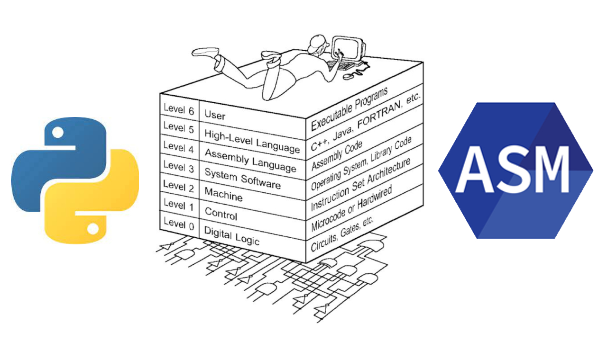

# 
 ⚙️🖥 Assembler and Disassembler Implemented in Python and Assembly Languages 

## Table of Contents
 * [About the Project](#about-the-project)
	 * [Built With](#built-with)
 * [Getting Started](#getting-started)
	 * [Prerequisites](#prerequisites)
	 * [Usage](#usage)
* [Contact](#contact)

<!-- ABOUT THE PROJECT -->
## About The Project
This is a **Machine language and Assembly** course project. The goal is to design **an assembler and a disassembler** for the assembly64 language where the assembler converts asm64 commands to hexadecimal equivalents, and the disassembler converts the binary strings into asm64 commands.
I've implemented them first using the python language and then using the assembly language itself. 
My reference for the conversions was [this site](https://defuse.ca/online-x86-assembler.htm). 

The codes are beautifully commented and can help you easily understand how things are working.

Both projects got the **highest score** in class and passed all the cases.

### Built With
* [Python3](https://www.python.org/)
* [Assembly64](http://assembly64.retrohack.se/assembly/)

<!-- GETTING STARTED -->
## Getting Started

### Prerequisites
 - Ubuntu and Intel chip 
 - VSCode (preferred)
 
 You can't run the assembly codes on a MacBook M1 machine :( 

### Usage
The codes contain very useful comments which make things crystal clear.
 
#### Commands Supported
The supported commands are:
mov, add, adc, sub, sbb, and, or, xor, dec, inc, cmp, test, xchg, xadd, imul, idiv, bsf, bsr, stc, clc, std, cld, shl, shr, neg, not, call, ret, syscall, push, pop

#### Arguments Supported
Arguments can be:
| First Operand | Second Operand |
|--|--|
| register(8/16/32/64 bits) | register(8/16/32/64 bits) |
|register(8/16/32/64 bits)| memory(32/64 bits- direct/indirect) |
| memory(32/64 bits- direct/indirect)|register(8/16/32/64 bits)| 
|register(8/16/32/64 bits)| immediate data |
|memory(32/64 bits- direct/indirect)| immediate data |

<!-- CONTACT -->
## Contact
If you have any further questions, please contact me via email.

Parisa Rabbany - Parisa.Rabbany.pr@gmail.com
